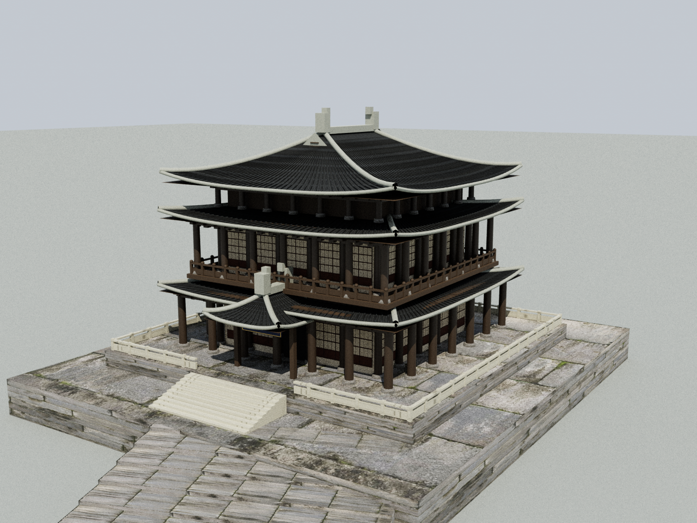
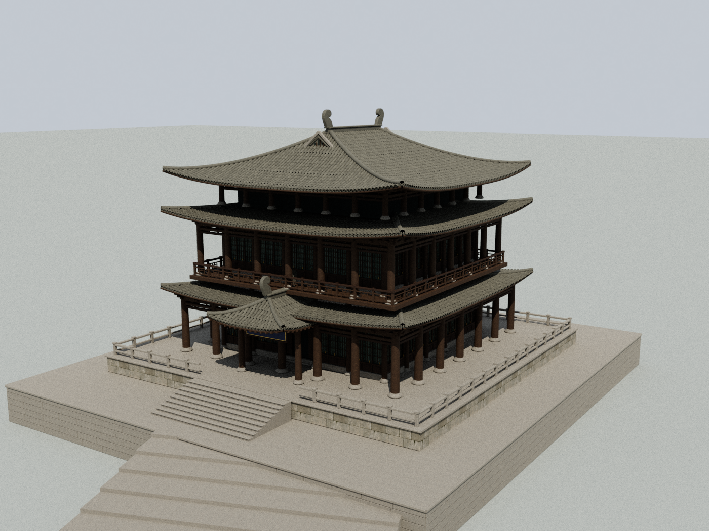
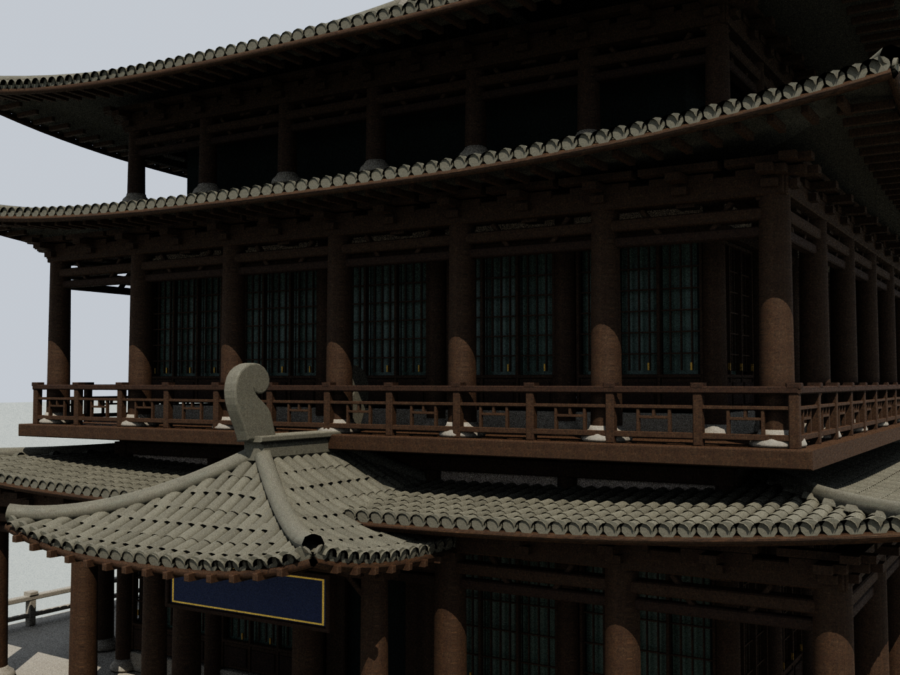

# 桂林近景模型与材质 · 2026-09-05

本轮根据用户“先把建模搞好”的要求，集中精修逍遥楼，并更新共享建筑材质与滨江步道。以仓库内逍遥楼实拍和既有地理数据为依据；建筑细部仍为照片引导的近似重建，没有新增实地测绘。

## 建模与表面

- 逍遥楼保留原地理锚点、朝向、两层三檐和 24 米总高。逐片搭接的曲面青瓦、独立瓦当、檐下椽尾及卷曲脊饰替换连续瓦垄和方块脊饰。
- 门窗采用凹进的背板、窗框、窗棂、门板与把手；阳台为镂空木栏。柱身提高圆度，增加有轮廓的石柱础、梁架和斗拱。
- 台基增加有实际厚度和灰缝的石块，台阶增加踏步边缘。木构、石材边缘做小倒角。
- 木材、石铺地、抹灰墙使用原始 1K 颜色、法线、粗糙度、AO 四通道贴图。只有颜色通道按 sRGB 解码。UV 按米铺设，长木构的木纹顺着构件延伸；滨江铺装按路径长度重复，修正大范围拉伸。
- 灰瓦和台基石材暂以抹灰扫描的微表面配合独立颜色、粗糙度和法线强度近似，不声称采用了逍遥楼原材质扫描。
- 滨江座椅采用分开的木条，行道树改用地图已有的带透明叶片的树冠构件。保留已纠正的临江灯柱和平台位置。
- 降低白昼环境补光，缩小阴影偏移以恢复柱脚接触阴影。夜景由局部灯光照亮木石表面。

## 素材来源

全部为 Poly Haven CC0 原始 1K JPG，12 个文件合计 5,389,702 字节。原文件逐一验证 SHA-256 后复制；来源、作者、物理宽度、下载 URL 与哈希见 [`SOURCES.json`](../public/yunyou/assets/tex/pbr/SOURCES.json)。

- [Fine Grained Wood](https://polyhaven.com/a/fine_grained_wood)，Rob Tuytel。
- [Large Grey Tiles](https://polyhaven.com/a/large_grey_tiles)，Rob Tuytel。
- [Painted Plaster Wall](https://polyhaven.com/a/painted_plaster_wall)，Amal Kumar。
- [Poly Haven CC0 许可](https://polyhaven.com/license)。

## 性能与验证

重复瓦片和瓦当使用实例批次。近景模型合批后为 31 个网格、342,024 个三角形；提高的是近处轮廓与构件细节。瓦片/瓦当在手机 125 米、桌面 180 米之外隐藏，保留曲面屋顶壳体；15% 距离滞回避免在边界频繁切换。更远处继续使用地图原有简模切换。

已通过完整近景几何检查（有限坐标、UV、索引、地标高度、河道与街面碰撞）、现有漫游输入检查和生产构建。模型离线检查还发现了斗拱上端穿出瓦面的情况，已降低檐下梁架并重新渲染。

尚未进行实际 WebGL 画面验收或真机帧率测量；离线检查不能替代这两项。

## 同条件模型视图

下列图片均从实际地图模型导出，再使用相同相机与光照进行离线路径追踪。它们用于检查几何和材质，**不是网页截图**；网页的实时光照、阴影、抗锯齿和文字显示会不同。

基线为 `8b7c01c7733d33fd2ef0560f17f32aa94c921d13`。新旧全景均为 1400 × 1050、64 samples/pixel、固定随机种子 24。

### 修改前



### 修改后



### 近景



## 复现模型检查

运行时继续使用原有 Three.js r170；没有更改应用依赖或构建配置。以下工具仅用于离线检查，需在检查环境另行安装 `@napi-rs/canvas`、`mitsuba==3.9.1` 和 `numpy`，它们不是网站运行依赖。

```sh
node --loader ./scripts/yunyou-node-loader.mjs scripts/export-yunyou-model.mjs public/yunyou /tmp/yunyou-model
python3 scripts/render-yunyou-model.py /tmp/yunyou-model /tmp/yunyou-overview.png overview 1400 64
python3 scripts/render-yunyou-model.py /tmp/yunyou-model /tmp/yunyou-close.png close 1400 64
```

导出文件是便于检查的中间网格和材质数据。离线渲染器近似 Three.js 的标准材质，不复现全部网页材质特性。中文匾额的离线文字取决于检查环境所装字体。

## 城中地图扩展、触控与实景照片（同日后续）

- 新增 13 个地点：七星公园、花桥、七星岩、栖霞禅寺、骆驼山、普陀山、月牙山、桂海碑林、穿山景区、塔山·穿山塔、西山公园、隐山、虞山公园。全部加入列表、关键词搜索、逐站导览及照片卡片。现共 37 个地点。
- 新区域公园边界、水系、道路与普通建筑来自 2026-09-05 OSM map API，按原投影换算；区域 JSON 记录请求源，footprint 记录 OSM 要素链接。新增道路/建筑仅覆盖原核心数据边界外，避免重复。`scripts/build-yunyou-expansion.py` 可从四个 OSM XML 提取复现（需要 shapely）。
- 山体高度、峰形、寺院与碑林细节为地理位置约束下的近似模型，并非测绘或照片扫描。七星岩只建洞口，没有虚构地下路线。花桥沿实际跨水桥段定位，四个拱洞使用开口外轮廓保证真实透空；栏杆近景按需细化。概览新增约 22,415 三角形。
- 地区道路、水系、建筑在接近时才请求 JSON；Worker 完成三角化后转移缓冲区，避免主线程处理全部新区。区域缓存手机最多 2 块、桌面最多 3 块，离开区域后隐藏，超过预算释放旧几何。核心城区已有底图保留常驻。
- 取消所有精模开场预加载。手机附近最多 2 个精模、缓存最多 3 个；桌面附近最多 3 个、缓存最多 6 个。串行创建，在触摸、飞行和后台时暂停；过期结果与离开后被挤出的模型释放几何及专属材质，保留共享材质和原始 JS 模块缓存。
- 取消与 OrbitControls 竞争的自定义 touch/wheel 缩放及其重复复杂射线求交。统一使用一个手势控制器；双指为缩放和平移，双指变单指后锁定到全部抬起，避免误旋转。覆盖取消、失去捕获、窗口失焦及重合/额外触点。旋转 .35、缩放 .55、平移 .55，关闭惯性。
- 手机默认流畅画质、1 倍像素比、1024 阴影，不使用实时水面反射；叶片树数量从 240 降至 80（桌面 160），手机关闭叶片投影。保留手动提高画质选项。未测量实际手机 FPS，不能据离线检查声称真机已验收。
- 全部 37 个地点有真实照片，共 31 张不同原图，约 9 MB；只给当前打开卡片设置图片地址。图片来自景区官网、报刊与明确署名的旅游图片来源；不把非官方来源标作官方，也不将公开可见误标为开放许可。来源、作者、原图 URL、校验和及权利说明位于 `assets/photos/places/SOURCES.json`。
- 王城榕树、隐山、普陀山、月牙山、游船等使用了明确说明拍摄位置的环境照片；榕树图是承运门前而非正阳门前特写，游船图是市区湖区而非漓江对应航迹。卡片保留这些区别和原刊水印。

新增验证：真实 vendored OrbitControls 的手势事件检查、串行/LRU/过期释放检查、新区几何有限坐标与预算、花桥四拱实际射线透空、37 处照片完整性。既有模型/河道航迹/街道碰撞检查和项目构建通过。没有进行浏览器或真机验收；预览供用户继续体验反馈。
